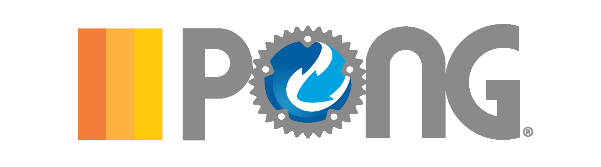

# good-game-rusty-pong

GGRP (Good Game Rusty Pong) is an open-source, mainly learning exercise, online multiplayer pong game.

[![Build status][build-image]][build-url]

This game is using the [macroquad](https://crates.io/crates/macroquad) crate for drawing the game on screen.  
For the netcode part, the game is using the rust implementation of GGPO, [GGRS](https://crates.io/crates/ggrs), from which the name convention is borrowed.

## Features
- Highly exciting, high-stakes, game of Pong.
- Rollback netcode, courtesy of GGRS.

<!-- Badges -->

[build-image]: https://github.com/idokendo/good-game-rusty-pong/actions/workflows/CI.yml/badge.svg
[build-url]: https://github.com/idokendo/good-game-rusty-pong/actions/workflows/CI.yml
